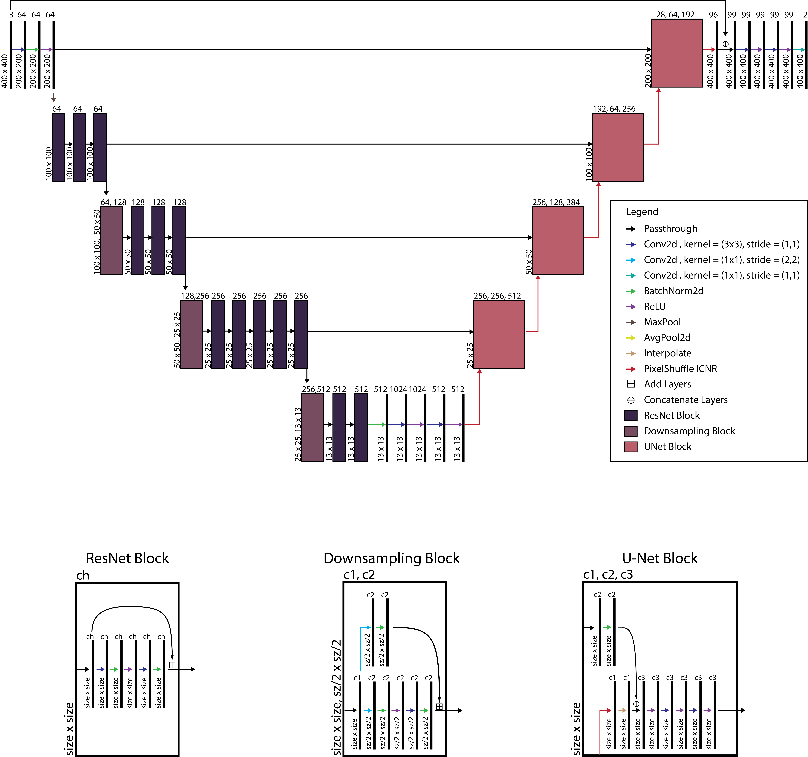
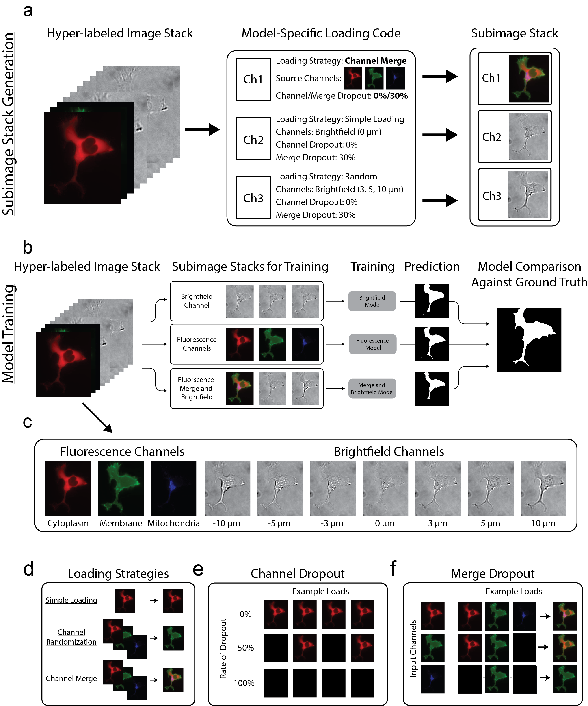
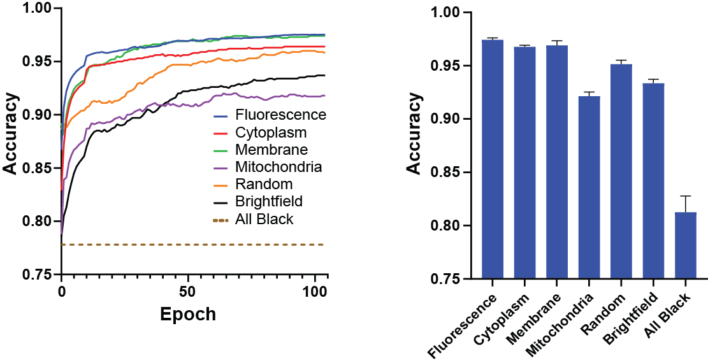
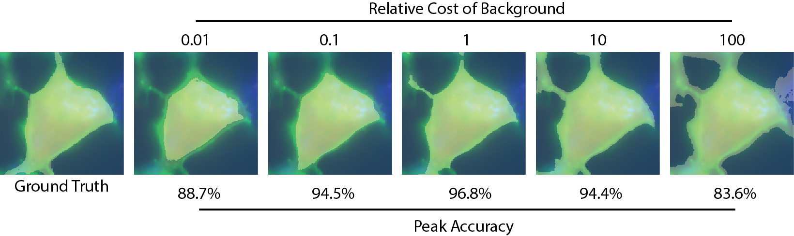
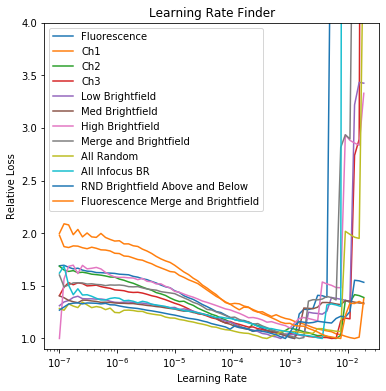

# Cell Segmentation using Deep Learning

## Overview:

A module to train cell segmentation models using deep learning, as outlined in "Cell segmentation using deep learning: comparing label and label-free approaches using hyper-labeled image stacks"  (WD Cameron, CV Bui, AM Bennett, HH Chang, and JV Rocheleau). 

## Quickstart:
Make sure you have the base requirements intalled and have a CUDA-enabled GPU.  Download the "Model Trainer" dataset from the provided link and unzip it into a `.data` folder in your home user directory.  Open [**Segmentation Model Trainer.ipynb**](Segmentation%20Model%20Trainer.ipynb) and run the cells to train the default models.  Further instructions are provided in the notebook.

## Requirements:
* PyTorch (conda install -c pytorch pytorch)
* Pandas (conda install -c anaconda pandas)
* Numpy (conda install -c anaconda numpy)
* ImageIO (conda install -c menpo imageio)
* FastAI (conda install -c fastai fastai)

## Notebooks and Scripts:

There are two main notebooks:
* [**Subimage Generation.ipynb**](Subimage%20Generation.ipynb): Will help you process your cell images from a larger microscope image.
* [**Segmentation Model Trainer.ipynb**](Segmentation%20Model%20Trainer.ipynb): Used to train your semgentation models

Scripts can be found in the `utils` folder

## Dataset:
Example datasets can be downloaded from [google drive using found here](https://drive.google.com/drive/folders/1jjcps5Qx7z8Sg0f_BlEX_sgG0MXncFZF?usp=sharing)

The following datasets are provided:
* **Model Trainer.zip**: 275 labelled cells and 175 cell-free negative controls.  Cells are labeled with a cytoplasmic, a membrane, and a mitochondrial tag.
* **Model Trainer - Test.zip**: 96 labelled cells and 60 cell-free negative controls.  Cells are labeled with an endoplasmic reticulum, a membrane, and a mitochondrial tag.
* **Model Trainer - External.zip**: Based on an externally-sourced dataset found [here](https://journals.plos.org/plosone/article?id=10.1371/journal.pone.0007497) 264 labelled cells and 122 cell-free negative controls.  Cells are labeled with a cytoplasmic and a nuclear tag.

For "Model Trainer", extract the archive to %USER%/.data/ to use with the **Segmentation Model Trainer.ipynb**.  Otherwise, modify the root_path variables as instructed.  The folder pointed to by **root_folder** should contain the following files and folders at a minimum:
- The "FullImage" folder
- The "Mask_Norm" folder
- The "codes.txt" file

## Architecture
Segmentation models are based on a variation of the U-Net model, which employs a descending arc (contracting path) to increase feature information followed by an ascending arc (expansion path) to combine feature and spatial information.
The model used here was composed of a traditional ResNet34 architecture for the descending arc path and a custom ascending arc that used pixel shuffling during upsampling to reduce checkerboard artifacts as outlined in the following graph:

## Substack Generation
Data is loaded into the model using loading codes.  Although these may represent channels from your image (e.g. [0,1,2] for the first three channels), it can also be used to do more complex loads such as:
* **Randomization**: Load a single random channel from a predefined subset of channels
* **Channel Dropout**: Perform a randomized test against a dropout percentage.  Load the channel normally if passed; load a blank channel otherwise
* **Merge**: Merge the contents from multiple channels into a single channel before loading
* **Merge Dropout**: Perform a randomized test against a dropout percentage and only include that particular channel in the merge if passed

Loading codes 51-199 are used to define custom behaviour.  If you wish to add your own loading code definitions, do so in `utils/segmentation_dataclass.py`

## Additional Features and Modules in "Segmentation Model Trainer.ipynb"
### Model Comparison
The ability to compare multiple models using the same dataset provides a powerful method of comparing cell labeling strategies or channel loading arrangements.  Use the multi-model trainer to train and compare multiple models.

### Data Augmentation (Transformation Explorer)
Data augmentation is a simple way to vastly expand the variety of data that's shown to the model.  This helps the model generalize well to new, unseen inputs.  Various types of transformations can be explored using the transformation module and added to training.

### Cross-Entropy Weighing
Weighing the background and cell losses differently will encourage the model to either tend to oversegment the cell, or undersegment the cell as shown here.  As there is a tradeoff between accuracy of the cell pixels and the background pixels, you will have to decide which you want to prioritize for your application.  

### Learning Rate Finder
Determining your maximum learning rate is a critical step when training deep learning models. Too high and the fit will diverge.  Too low and it will take a long time to reach a local minimum.  Use the learning rate module to determine the ideal learning rate for your dataset.  

